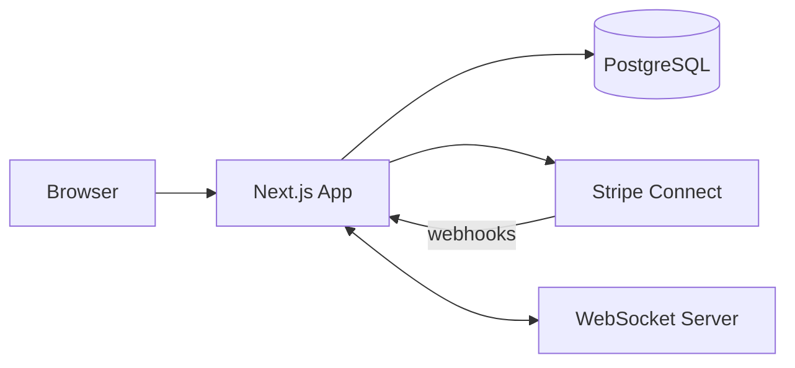

# 🛠️ Tech-Freelance

> A freelance marketplace connecting customers with independent technicians for computer repair, assembly, and remote support.


> 🚧 **This project is under active development.** Features are being built incrementally — see the [progress checklist](#-features) and [roadmap](#-roadmap) below.

**🔗 Live Demo:** _coming soon_ &nbsp;·&nbsp; **🎥 Demo Video:** _coming soon_

<!-- Uncomment once deployed
**Test accounts** (Stripe runs in test mode)
| Role | Email | Password |
|------|-------|----------|
| Customer | customer@demo.com | demo1234 |
| Technician | tech@demo.com | demo1234 |


-->

---

## 📌 Problem & Solution

**Problem:** When a computer breaks, it's hard to find a trustworthy technician. Pricing is often unclear, and people usually have to carry their machine to a shop.

**Solution:** Customers post a job, technicians submit offers, both sides communicate through real-time chat, and payment is held in escrow until the job is confirmed complete. The platform is **remote-support first**, so many issues can be solved without an on-site visit.

## ✨ Features

- [x] Authentication with separate **Customer** and **Technician** roles
- [ ] Job posting and technician bidding
- [ ] Real-time chat via WebSocket
- [ ] Escrow payments with **Stripe Connect** — technicians are paid once the customer confirms completion
- [ ] Ratings and reviews
- [ ] Technician dashboard (earnings, active jobs)

<!-- Tick [x] only for features that are actually working -->

## 🧰 Tech Stack

| Layer | Technology |
|-------|------------|
| Frontend | Next.js (App Router), TypeScript, Tailwind CSS, shadcn/ui |
| Backend | Next.js Route Handlers / Server Actions, WebSocket |
| Database | PostgreSQL (Neon / Supabase), Drizzle ORM |
| Payments | Stripe Connect (test mode) |
| DevOps | Docker, GitHub Actions, Vercel |

## 🏗️ Architecture



Database schema: _ERD coming soon_ (`docs/erd.png`)

## 💡 Technical Highlights

<!-- Fill these in as you build — explain the problem, your approach, and why -->
- **Escrow payment flow** — Stripe Connect with webhook handling, including idempotency to prevent duplicate processing.
- **Real-time chat** — _TBD_
- **Role-based access control** — _TBD_
- **CI/CD** — lint, type-check, and build run on every pull request via GitHub Actions.

## 🚀 Getting Started

### Prerequisites
- Node.js 20+
- PostgreSQL (local, Docker, or Neon/Supabase)
- Stripe account (test mode)

### Installation

```bash
git clone https://github.com/JapanDevV3/Tech-Freelance.git
cd Tech-Freelance
cp .env.example .env.local   # fill in DATABASE_URL, STRIPE_SECRET_KEY, etc.
npm install
npm run dev
```

Open [http://localhost:3000](http://localhost:3000) in your browser.

<!-- Add once available:
npm run db:migrate
docker compose up -d
-->

## 🗺️ Roadmap

- [ ] Core MVP: auth, job posting, bidding
- [ ] Real-time chat
- [ ] Stripe Connect escrow payments
- [ ] Reviews and technician dashboard
- [ ] Docker setup and CI pipeline
- [ ] Deploy to Vercel
- [ ] Email notifications
- [ ] On-site appointment booking
- [ ] Admin panel

## 👤 Author

**Nattasit Sukprasert (Japan)** — Full-stack Developer, Bangkok
[LinkedIn](https://linkedin.com/in/nattasit-sukprasert) · [Email](mailto:develop0131997@gmail.com)
